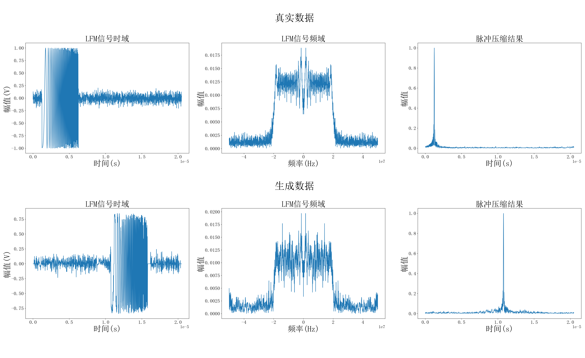
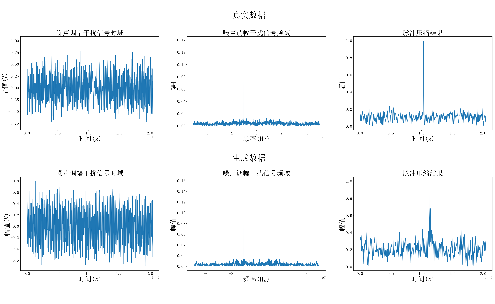
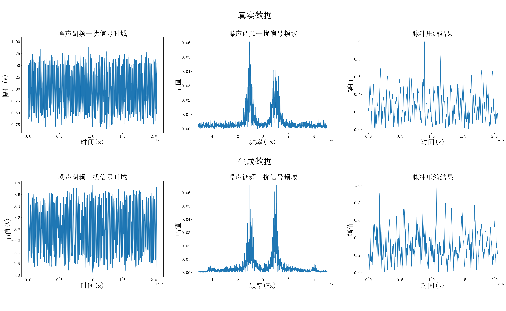
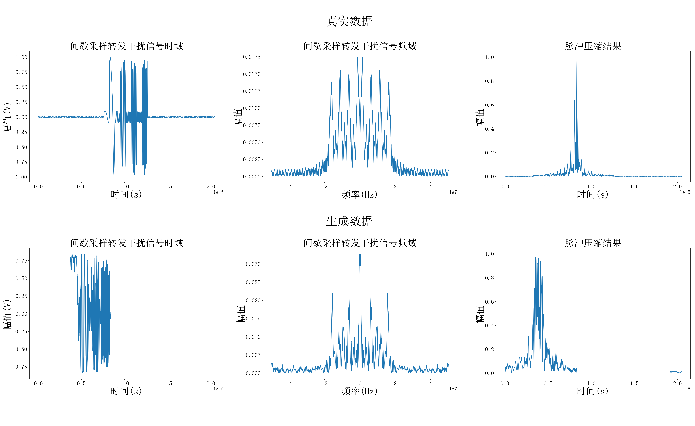
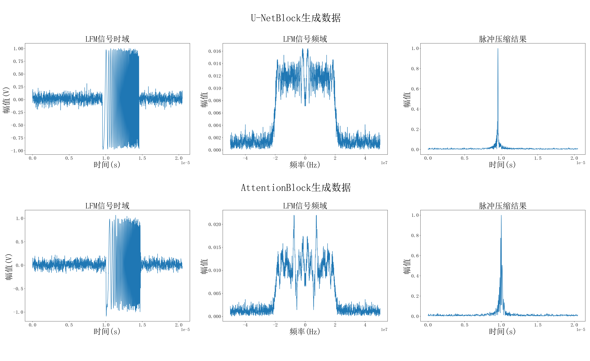
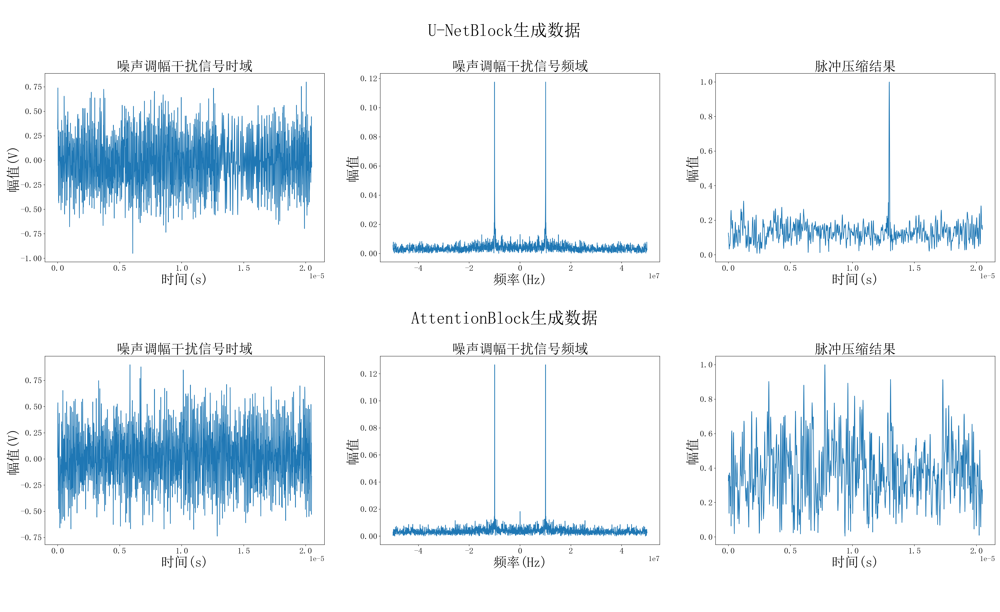
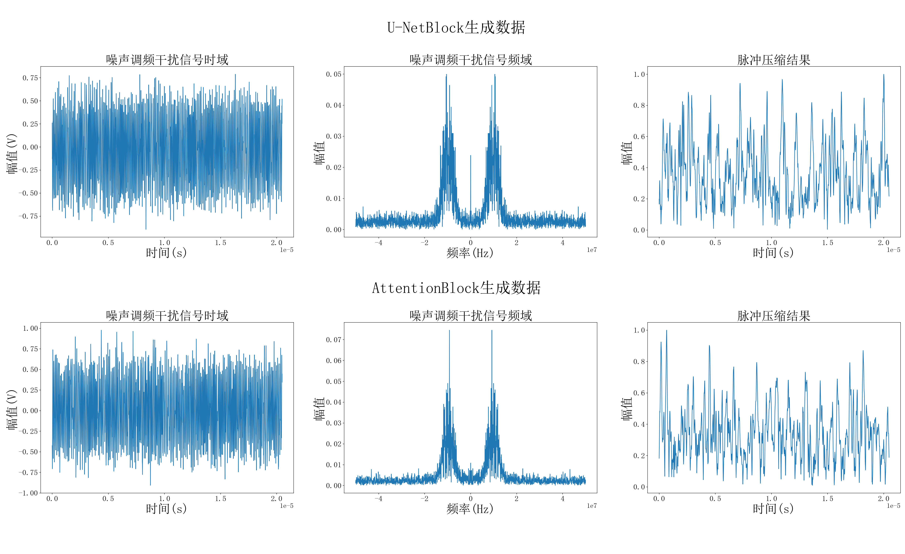
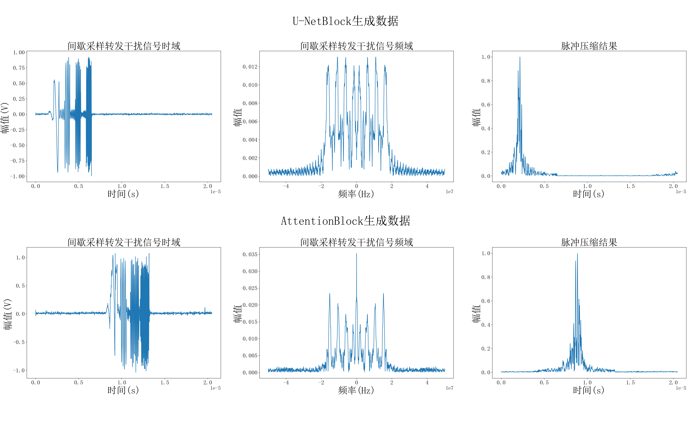

# Radar Generation

使用深度学习方法生成四种不同的雷达干扰信号回波代码

## Dataset

**仿真** ：使用Matlab仿真生成四种不同干扰信号的数据集用来训练

**Dataset.py** : 使用Matlab仿真的mat文件生成pytorch数据集

## GAN

**net.py** : GAN网络模型

**Multi_GPU_train.py** : 模型训练

**net_result_check.py** ：模型生成数据代码

#### 生成结果

- **LFM信号生成结果**：

- **噪声调幅干扰信号信号生成结果**：

**噪声调频干扰信号信号生成结果**：

**间歇采样转发干扰信号信号生成结果**：

## Diffusion

**diffusion.py** : diffusion模型以及训练和生成数据代码

**unet.py** : 噪声预测网络

**attention.py** ：噪声预测网络中嵌入Attention结构

#### 生成结果

- **LFM信号生成结果**：

- **噪声调幅干扰信号信号生成结果**：

**噪声调频干扰信号信号生成结果**：

**间歇采样转发干扰信号信号生成结果**：

## Evaluation

**GPU_eve.py** : 使用MSE、FRD、KRD三种方式计算生成数据与真实数据的距离分布，用来评价生成雷达信号的质量